# Triangle Counting with GraphBLAS

Implementation of triangle counting algorithms using [python-graphblas](https://github.com/python-graphblas/python-graphblas) and comparison with [LAGraph](https://github.com/GraphBLAS/LAGraph) reference implementations.


## Algorithms

**Burkhardt:**
$$\text{triangles} = \text{sum}(\text{sum}((A^2) .* A)) / 6$$

**Sandia:**
$$\text{triangles} = \text{sum}(\text{sum}((L \times L) .* L)), \quad L = \text{tril}(A)$$

**Naive** (excluded from benchmarks due to OOM on available hardware):
$$\text{triangles} = \text{tr}(A^3) / 6$$

## Environment

| Parameter | Value |
|-----------|-------|
| Device | Huawei MCLF-XX |
| CPU | Intel Core i5-12450H |
| RAM | 16 GB |
| OS | Ubuntu 24.04.4 |
| GCC | 13.3 |
| Python | 3.12.3 |
| SuiteSparse:GraphBLAS | 9.4.5 |
| LAGraph | 1.2.1 |

`scripts/fix_freq.sh`:
- Disables background system services and timers
- Disables CPU Turbo Boost
- Disables CPU idle states
- Moves interrupt handling to E-cores
- Sets battery charge threshold to 85–90%

`lagraph_bench.sh` / `py_bench.sh`:
- execute `fix_freq.sh` before the bench.
- Purge OS page caches.
- Isolate P-cores.
- Collect results.

# How to run: 

### Install SuiteSparse
GraphBLAS
```
git clone --depth 1 --branch v9.4.branch https://github.com/DrTimothyAldenDavis/GraphBLAS.git
cd GRAPHBLAS
cmake -B build -DCMAKE_BUILD_TYPE=Release
cmake --build build --parallel $(nproc)
sudo cmake --install build
```
LAGraph
```
git clone --depth 1 https://github.com/GraphBLAS/LAGraph.git
cd LAGraph
cmake -B build -DCMAKE_BUILD_TYPE=Release
cmake --build build --parallel $(nproc)
sudo cmake --install build
```
Clone repo:
```
git clone https://github.com/fox56tm/graph_blas_triag_counting
```
### Install Python dependencies
Install uv and after that:
```
cd graph_blas_triag_counting
uv sync
```

### Build

```
cmake . -B build -DCMAKE_EXPORT_COMPILE_COMMANDS=ON
cmake --build build
```
## Reproducing Experiments


```
cd data
wget https://sparse.tamu.edu/MM/SNAP/amazon0302.tar.gz
wget https://sparse.tamu.edu/MM/LAW/amazon-2008.tar.gz
wget https://sparse.tamu.edu/MM/SNAP/cit-Patents.tar.gz
wget https://sparse.tamu.edu/MM/SNAP/roadNet-CA.tar.gz
wget https://sparse.tamu.edu/MM/SNAP/web-NotreDame.tar.gz
wget https://sparse.tamu.edu/MM/SNAP/web-Stanford.tar.gz
for f in *.tar.gz; do
    tar -xzf "$f"
done
cd ..
```

## Dataset description

| Name | Vertices | Edges |
|------|----------|-------|
| amazon0302 | 262,111 | 1,234,877 |
| amazon-2008 | 735,323 | 5,158,388 |
| cit-Patents | 3,774,768 | 16,518,948 |
| roadNet-CA | 1,971,281 | 2,766,607 |
| web-NotreDame | 325,729 | 1,497,134 |
| web-Stanford | 281,903 | 2,312,497 |

Graphs were selected to cover different topologies.

### Stabilize the environment

### Before run you need do this steps:
- Disables background system services and timers
- Disables CPU Turbo Boost
- Disables CPU idle states (C-states)
- Moves interrupt handling to E-cores
- Sets battery charge threshold to 85–90% (if you run on pc you don't need do this)

e.g. check `scripts/fix_freq.sh`

Check `scripts/py_bench.sh` and `scripts/lagr_bench.sh` (These scripts runs benchmarks for python-graphblas and LAGraph).

Ensure that the number of P-cores for your test machine is specified in these scripts.

### 3. Run benchmarks

```
# python-graphblas benchmarks
sudo bash scripts/py_bench.sh

# LAGraph benchmarks
sudo bash scripts/lagraph_bench.sh
```

For python-graphblas each algorithm is run 45 times per graph, first 15 runs are warmup and excluded from results. All runs are pinned to P-cores.

Results are saved to `results/` as CSV files.

### 4. Plot results

```
cd src
uv run plot_all.py
```

## Results

### Sandia vs Burkhardt

Sandia in 2-6 times faster than Burkhardt on all graphs.


### python-graphblas vs LAGraph

python-graphblas performance is comparable to LAGraph. On most graphs Burkhardt implementations show statistically indistinguishable results. On several graphs python-graphblas outperforms LAGraph (e.g. roadNet-CA). To investigate the issue, profiling was conducted via perf and flame graphs were constructed(this will be discussed further below).

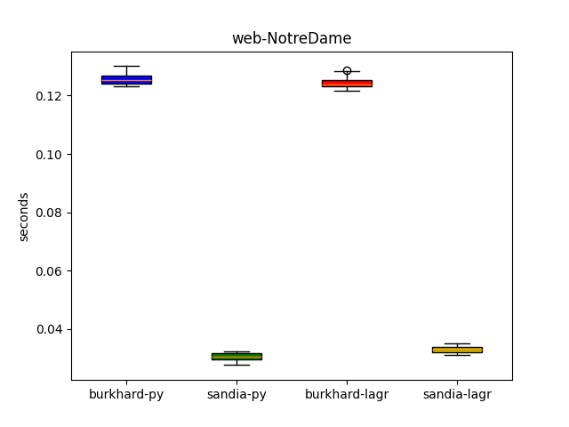
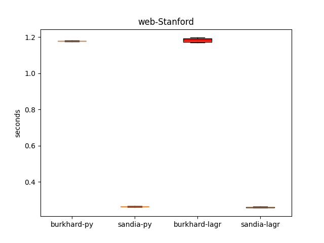
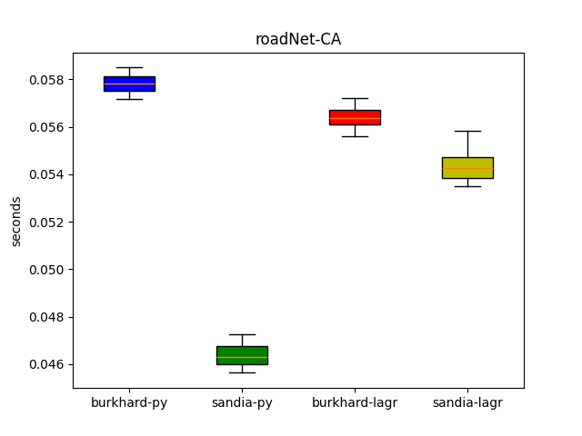
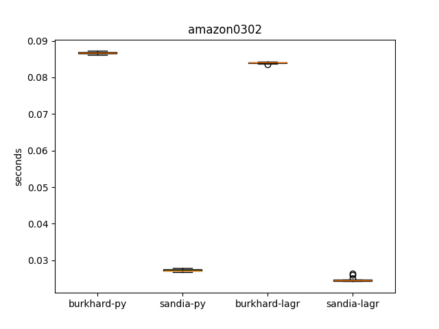
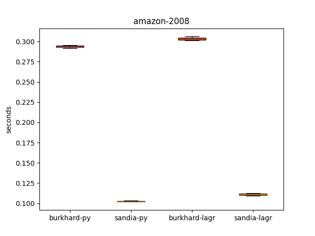
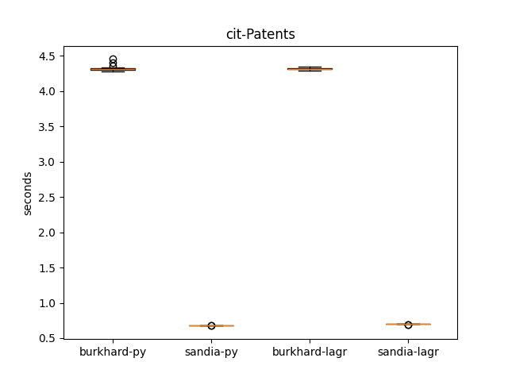

more boxplots(`plots/boxplots/`)
### Result analysis

The results show the mean values, the 95% confidence intervals. Also  the table includes the sample standard deviation alongside its relative percentage to the mean.

Outliers were observed in some measurements and normality tests did not pass. However, outliers do not affect the conclusion: they appear in both python-graphblas and LAGraph implementations and are therefore The relative position of boxplots and confidence intervals between python-graphblas and LAGraph remains stable regardless of outliers.

| Graph | Configuration | Mean | Std Dev (%) | SEM | Confidence Interval 95% |
| :--- | :--- | :---: | :---: | :---: | :---: |
| **web-NotreDame** | burkhard-py | 0.1257 | 0.001985 (1.57%) | 0.000362 | 0.1257 ± 0.0007 |
| | sandia-py | 0.03050 | 0.001463 (4.85%) | 0.000267 | 0.03050 ± 0.0005 |
| | burkhard-lagr | 0.1244 | 0.002701 (2.16%) | 0.000493 | 0.1244 ± 0.0007 |
| | sandia-lagr | 0.0331 | 0.000884 (2.64%) | 0.000161 | 0.0331 ± 0.0004 |
| **web-Stanford** | burkhard-py | 1.1784 | 0.006097 (0.52%) | 0.001113 | 1.1784 ± 0.0005 |
| | sandia-py | 0.2643 | 0.001346 (0.51%) | 0.000246 | 0.2643 ± 0.0004 |
| | burkhard-lagr | 1.1804 | 0.010226 (0.87%) | 0.001867 | 1.1804 ± 0.0038 |
| | sandia-lagr | 0.2607 | 0.002615 (1.00%) | 0.000477 | 0.2607 ± 0.0004 |
| **roadNet-CA** | burkhard-py | 0.05783 | 0.000330 (0.57%) | 0.000060 | 0.05783 ± 0.00014 |
| | sandia-py | 0.0464 | 0.000592 (1.30%) | 0.000108 | 0.0464 ± 0.0002 |
| | burkhard-lagr | 0.0564 | 0.000552 (0.99%) | 0.000101 | 0.0564 ± 0.0002 |
| | sandia-lagr | 0.0543 | 0.000720 (1.32%) | 0.000131 | 0.0543 ± 0.0002 |
| **cit-Patents** | burkhard-py | 4.322 | 0.040947 (0.95%) | 0.007476 | 4.322 ± 0.012 |
| | sandia-py | 0.6794 | 0.002068 (0.30%) | 0.000378 | 0.6794 ± 0.0009 |
| | burkhard-lagr | 4.309 | 0.012695 (0.29%) | 0.002318 | 4.309 ± 0.005 |
| | sandia-lagr | 0.6982 | 0.002949 (0.42%) | 0.000538 | 0.6982 ± 0.0012 |
| **amazon-2008** | burkhard-py | 0.2935 | 0.001290 (0.44%) | 0.000235 | 0.2935 ± 0.0004 |
| | sandia-py | 0.10256 | 0.000299 (0.29%) | 0.00055 | 0.10256 ± 0.00013 |
| | burkhard-lagr | 0.3023 | 0.000890 (0.29%) | 0.000162 | 0.3023 ± 0.0003 |
| | sandia-lagr | 0.1111 | 0.000957 (0.86%) | 0.000175 | 0.1111 ± 0.0004 |
| **amazon0302** | burkhard-py | 0.08680 | 0.000328 (0.38%) | 0.000060 | 0.08680 ± 0.00011 |
| | sandia-py | 0.02726 | 0.000238 (0.87%) | 0.000043 | 0.02726 ± 0.00010 |
| | burkhard-lagr | 0.0835 | 0.000544 (0.65%) | 0.000099 | 0.0835 ± 0.0004 |
| | sandia-lagr | 0.02451 | 0.000876 (3.57%) | 0.000160 | 0.02451 ± 0.00013 |
### Profiling

To investigate why Python outperforms LAGraph on certain graphs, flame graphs were built using `perf`.
Profiling was performed with a sampling frequency of 99 Hz. (more in `scripts/perf_lagr.sh`/`scripts/perf_py.sh`)

The profiling results are presented below:

Metric calculate: Function Overhead (%) = (Samples of the specific function / Total samples of the parent or top-level function) * 100%

A higher percentage means the function spent more(CPU) actual runtime executing that specific block of code.

Functions that took longer on which graph below:

#### 1.roadNet-CA(sandia)

GB_AxB_saxpy3_flopcount._omp_fn.0:  ~19.08% on LAGraph / ~10.41% on python-graphblas

GB_select_positional_phase1._omp_fn.1:  ~14.96% on LAGraph / ~7.07% on python-graphblas

GB_msort_3._omp_fn.0:  ~6.59% on LAGraph / ~3.29% on python-graphblas

LAGraph(sandia):
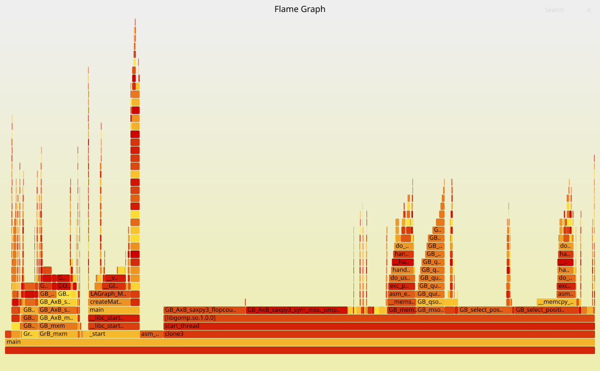
python-graphblas(sandia):
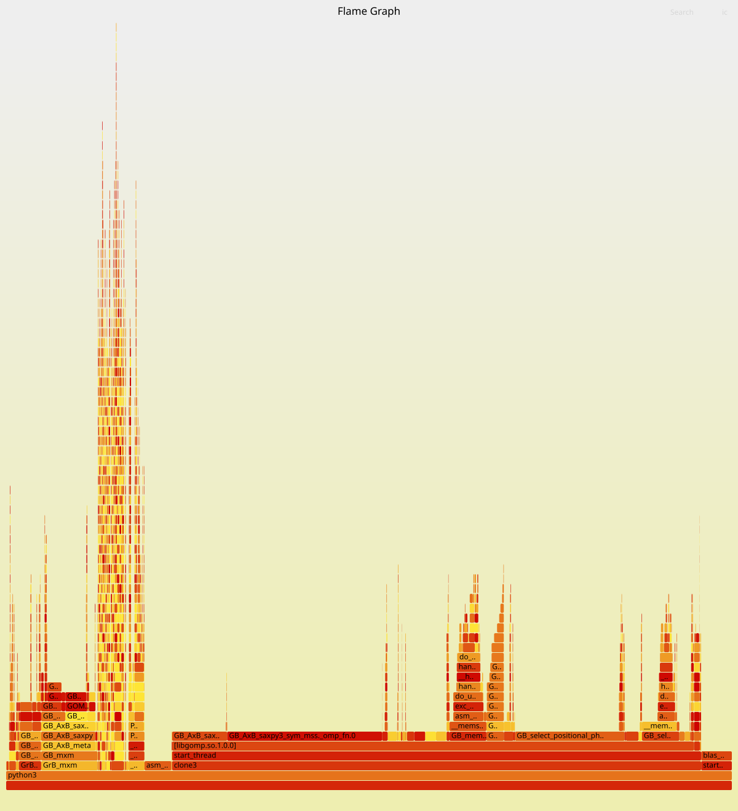

#### 2.amazon-2008(sandia)

GB_AxB_saxpy3_flopcount._omp_fn.0:  ~39.26% on LAGraph / ~40.29% on python-graphblas

GB_select_positional_phase1._omp_fn.1:  ~3.24% on LAGraph / ~2.28% on python-graphblas

GB_msort_3._omp_fn.0:  ~3.5% on LAGraph / ~2.57% on python-graphblas

Although these specific functions differ by only ~1%, the functions called by them also take slightly more time, compounding the overall runtime difference

LAGraph(sandia):
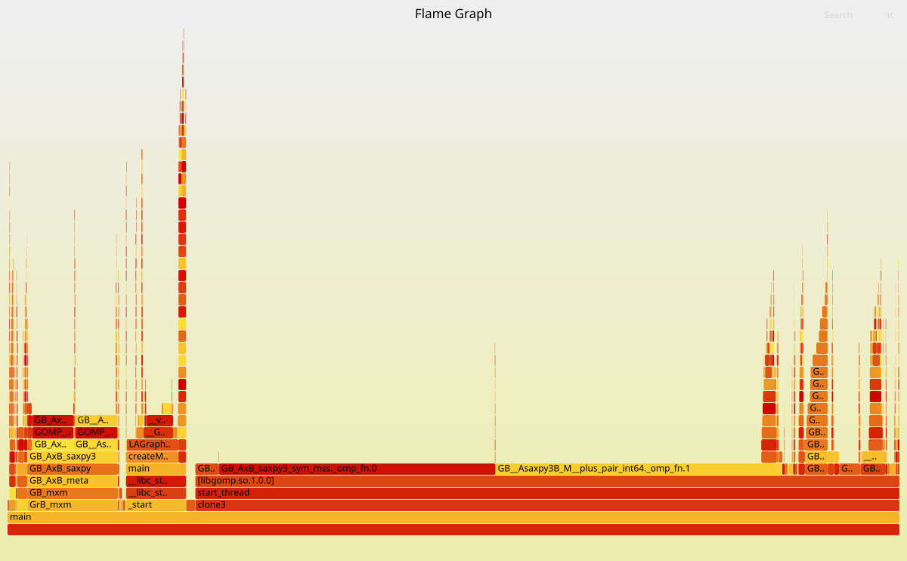
python-graphblas(sandia):
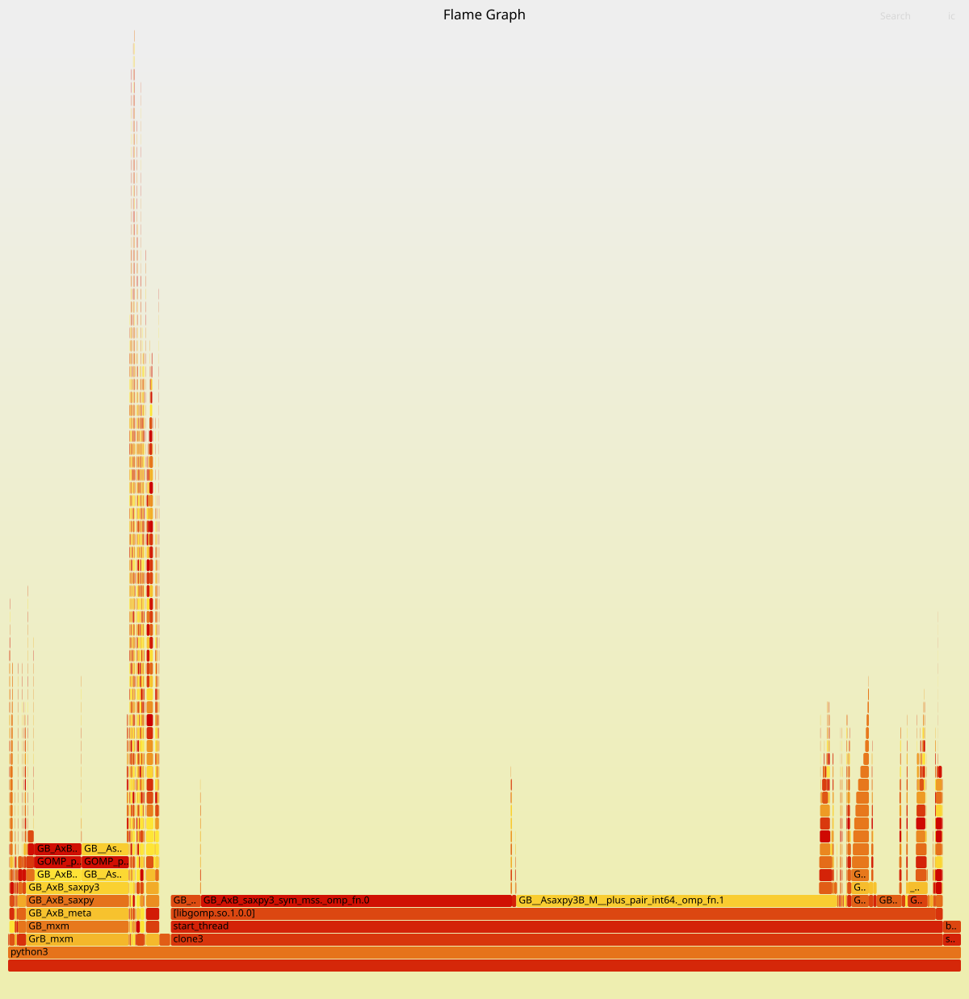

#### 3.web-NotreDame(sandia)

GB_AxB_saxpy3_flopcount._omp_fn.0:  ~4.83% on LAGraph / ~2.74% on python-graphblas

GB_msort_3._omp_fn.0:  ~5.22% on LAGraph / ~2.74% on python-graphblas

LAGraph(sandia):
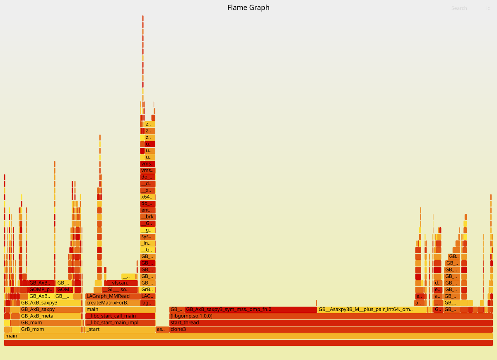
python-graphblas(sandia):
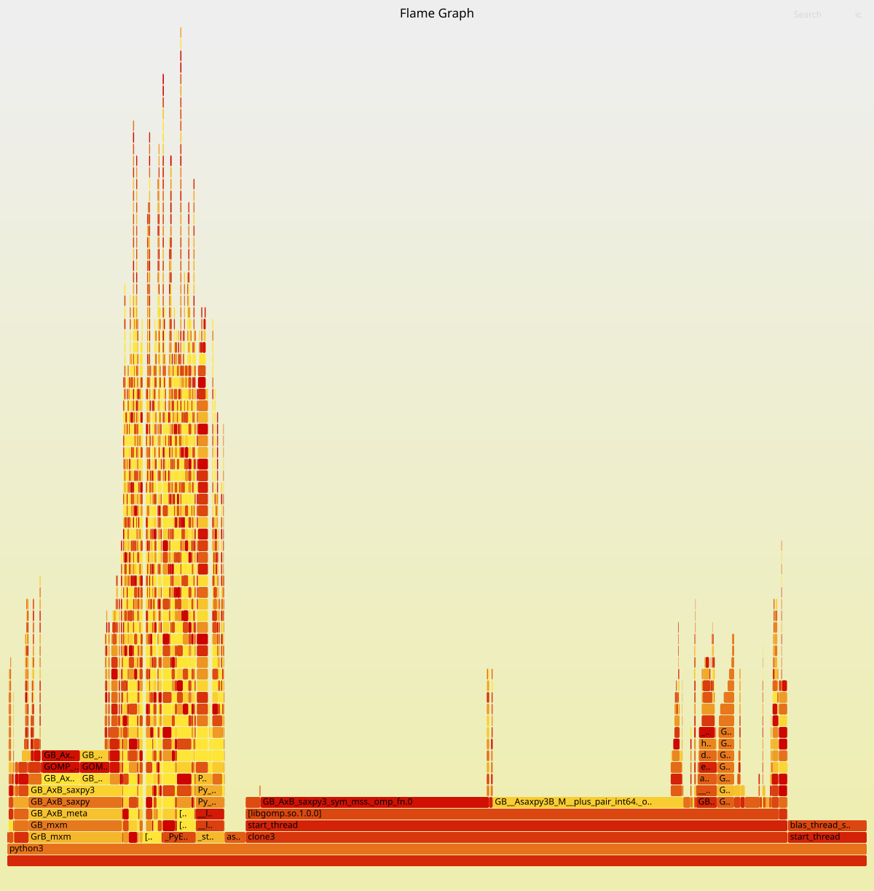
 
## Outlier Elimination Attempts

The following measures were taken to eliminate outliers - none had a significant effect:

- Fixing CPU frequency to min via `scaling_min_freq` / `scaling_max_freq`
- Fixing CPU frequency to max - same result
- CPU isolation via GRUB: `isolcpus=0-7 nohz_full=0-7 rcu_nocbs=0-7` 
